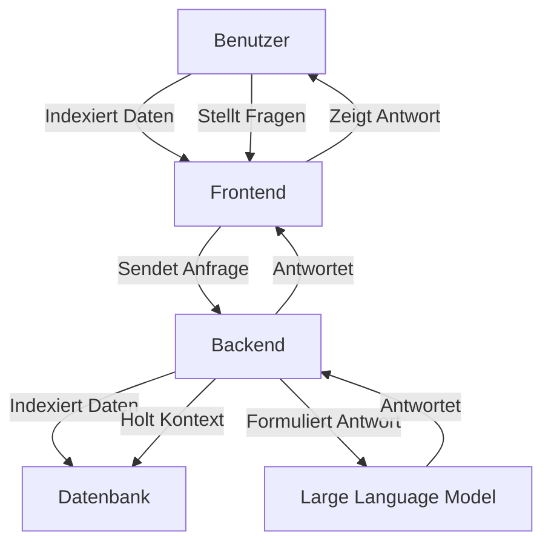

<p align="center"></p>
<p align="center"></p>

## Inhaltsverzeichnis

- [Kontext des Projekts](#kontext-des-projekts)
- [Hintergrund & Idee](#hintergrund--idee)
- [Details zur Umsetzung](#details-zur-umsetzung)
- [HagenCopilot ausführen](#hagencopilot-ausführen)
- [Evaluationspipeline ausführen](#evaluationspipeline-ausführen)

## Kontext des Projekts

Der Kontext des Projektes bezieht sich auf das Fachpraktikum Sprachtechnologie der Fernuniversität Hagen im Sommersemester 2024. Der Rahmen, in dem sich dieses Projekt bewegte, wurde durch das Center of Advanced Technology for Assisted Learning and Predictive Analytics (CATALPA) bereitgestellt.

## Hintergrund & Idee

Das Moodle der Fernuni Hagen ist eine studiengangsübergreifende Plattform, die für Lehrveranstaltungen und zum Informationsaustausch zwischen Studierenden verwendet wird. Zu jedem Modul werden Lehrmaterialien und andere Ressourcen zur Verfügung gestellt und es gibt ein Forum, in welchem Studierende Fragen stellen können. Manche Fragen können nur von den Lehrenden beantwortet werden, was zu einer längeren Wartezeit führt.

Ein Q&A-Chatbot wäre daher ein sinnvolles Moodle-Plugin, um die Studierenden schnell zu unterstützen. Der von uns entwickelte Prototyp kann fachliche Fragen sowie Fragen zum Studienverlauf/Prüfungsordnung schnell und korrekt beantworten, vorausgesetzt, die Antwort verbirgt sich in einem der Lehrmaterialien oder im Modulhandbuch/ der Prüfungsordnung. Die Lehrenden haben dadurch weniger Aufwand und die Studierenden erhalten schnell eine Antwort. Der Chatbot gibt nicht nur eine Antwort aus, sondern verweist auf die relevanten Quellen, die auch während der Konversation hochgeladen werden können. Ursprünglich sollte der Chatbot die Forenbeiträge dynamisch indizieren, um das Stellen von ähnlichen Fragen zu vermeiden, falls es schon eine passende Antwort im Forum gibt. Aus Datenschutzgründen war das jedoch schwierig umzusetzen, da eine Verarbeitung der Forenbeiträge nur mit einer Einwilligung aller Teilnehmer möglich wäre.

## Details zur Umsetzung

Der Benutzer gibt in einem lokalen Ordner eine beliebige Anzahl an Dateien im .pdf-Format frei. Diese Dateien bilden die Grundlage der Informationen, mit denen der Chatbot mögliche Antworten generiert.

Im ersten Schritt werden diese Dateien durch einen Prozess in Vektoren aufgeteilt. Dieses Embedding hängt von der Größe der Datei bzw. der Textanteile ab: mehr Text bedeutet mehr Embeddings.

Sobald diese Datenbank verfügbar ist, kann der Benutzer über ein Chatportal mit dem Chatbot kommunizieren und gewünschte Informationen abrufen. Dabei lehnt sich das Design an einen klassischen Chatverlauf an, wie man ihn bspw. von ChatGPT oder anderen Portalen kennt.

Die Frage wird an das Backend weitergegeben, wo möglichst passend zu der Frage geeigneter Kontext aus der Datenbank abgerufen wird.

Das Large Language Model (LLM), welches freundlicherweise von dem Server der Fernuniversität Hagen genutzt werden durfte, formuliert abschließend eine wohlgeformte Antwort, die den Kontext zwar nicht wörtlich aus den PDF-Dateien wiedergibt, aber dem Benutzer das Gefühl gibt, dass eine reale Person die Antwort mit dem richtigen Inhalt verfasst hat.

Nach mehreren Updates der Benutzeroberfläche gab es bei dem letzten und bis jetzt aktuellen Update die Möglichkeit für den Benutzer, die Datenbank flexibel zu erweitern. So wurde ein Button eingefügt, der den Explorer öffnet und die Möglichkeit bietet, eine PDF-Datei auszuwählen. Nach einer kurzen Wartezeit, in der das Embedding wieder stattfindet, wird dem Benutzer ein Feedback nach erfolgreichem Upload gegeben. Sollte diese Datei schon in der Datenbank vorhanden sein, wird dem Benutzer eine Meldung zurückgegeben, dass diese Datei bereits existiert, Somit ist die Datenbank von Verunreinigungen bzgl. doppelter Datensätze geschützt.

### Example Markdown with Mermaid Diagram



## HagenCopilot ausführen

1. Stellen Sie sicher, dass Sie eine .env-Datei hinzufügen. Schauen Sie sich die .env-example-Datei an.

2. Installieren Sie die Python-Abhängigkeiten:

```bash
pip install -r backend/requirements.txt
```

````

3. Starten Sie docker-compose:

```bash
docker-compose up -d
```

4. Legen Sie PDF-Dateien in den `data`-Ordner und starten Sie die Indexierung der Dateien:

```bash
python backend/load_data.py
```

5. Starten Sie das Backend:

```bash
python backend/api.py
```

6. Nun Können Sie auf HagenCopilot unter http://localhost:3000 zugreifen.

## Evaluationspipeline ausführen

Stellen Sie sicher, dass die VPN-Verbindung besteht und docker-compose läuft und die Daten bereits indexiert wurden.

Führen Sie die Evaluationspipeline aus:

```bash
python backend/evaluation.py
```
````
