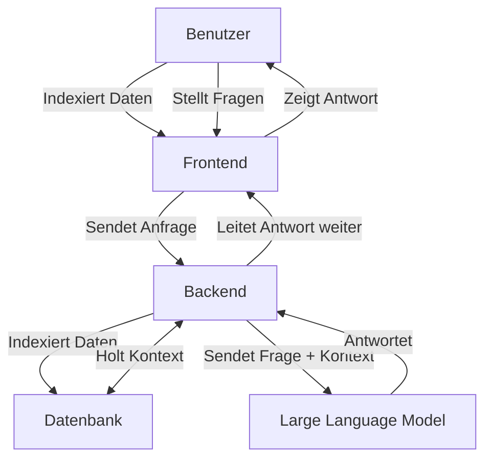
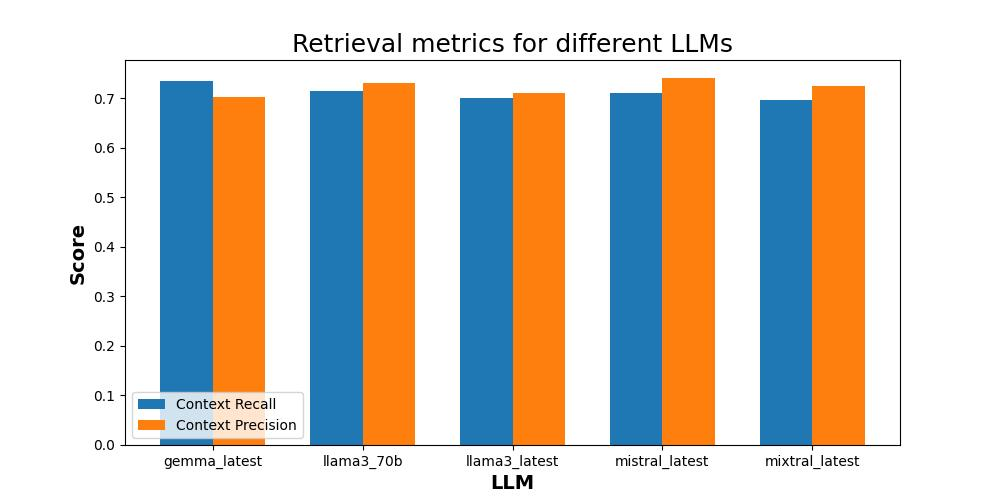
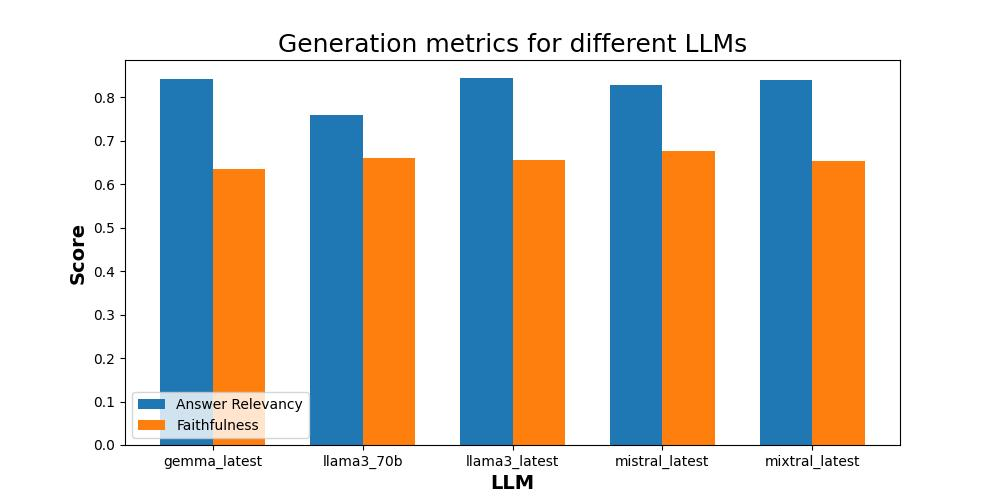
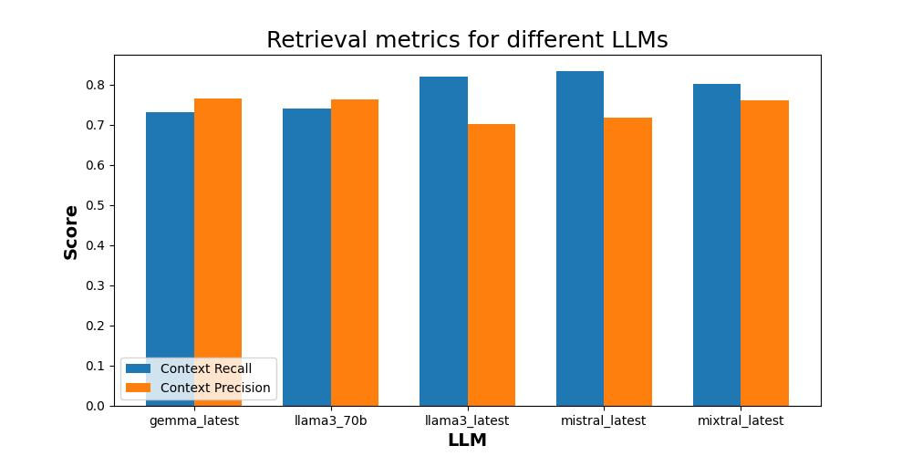

<p align="center"></p>
<p align="center"></p>

## Inhaltsverzeichnis

<ul>
  <li><a href="#hagencopilot-ausführen">HagenCopilot ausführen</a></li>
  <li><a href="#kontext-des-projekts">Kontext des Projekts</a></li>
  <li><a href="#hintergrund--idee">Hintergrund & Idee</a></li>
  <li><a href="#details-zur-umsetzung">Details zur Umsetzung</a></li>
  <li><a href="#lösungsskizze">Lösungsskizze</a></li>
  <li><a href="#evaluation">Evaluation</a>
    <ul>
      <li><a href="#datensatz">Datensatz</a></li>
      <li><a href="#metriken">Metriken</a></li>
      <li><a href="#ergebnisse">Ergebnisse</a></li>
      <li><a href="#evaluationspipeline-ausführen">Evaluationspipeline ausführen</a></li>
    </ul>
  </li>
</ul>

## HagenCopilot ausführen

1. Stellen Sie sicher, dass Sie eine .env-Datei hinzufügen. Schauen Sie sich die .env-example-Datei an.

2. Installieren Sie die Python-Abhängigkeiten:

```bash
pip install -r backend/requirements.txt
```

3. Starten Sie docker-compose:

```bash
docker-compose up -d

# To rebuild the docker images
docker-compose up -d --build
```

4. Legen Sie PDF-Dateien in den `data`-Ordner und starten Sie die Indexierung der Dateien:

```bash
python backend/load_data.py
```

5. Starten Sie das Backend:

```bash
python backend/api.py
```

6. Nun Können Sie auf HagenCopilot unter http://localhost:3000 zugreifen.

## Kontext des Projekts

Der Kontext des Projektes bezieht sich auf das Fachpraktikum Sprachtechnologie der Fernuniversität Hagen im Sommersemester 2024. Der Rahmen, in dem sich dieses Projekt bewegte, wurde durch das Center of Advanced Technology for Assisted Learning and Predictive Analytics (CATALPA) bereitgestellt.

## Hintergrund & Idee

Das Moodle der Fernuni Hagen ist eine studiengangsübergreifende Plattform, die für Lehrveranstaltungen und zum Informationsaustausch zwischen Studierenden verwendet wird. Zu jedem Modul werden Lehrmaterialien und andere Ressourcen zur Verfügung gestellt und es gibt ein Forum, in welchem Studierende Fragen stellen können. Manche Fragen können nur von den Lehrenden beantwortet werden, was zu einer längeren Wartezeit führt.

Ein Q&A-Chatbot wäre daher ein sinnvolles Moodle-Plugin, um die Studierenden schnell zu unterstützen. Der von uns entwickelte Prototyp kann fachliche Fragen sowie Fragen zum Studienverlauf/Prüfungsordnung schnell und korrekt beantworten, vorausgesetzt, die Antwort verbirgt sich in einem der Lehrmaterialien oder im Modulhandbuch/ der Prüfungsordnung. Die Lehrenden haben dadurch weniger Aufwand und die Studierenden erhalten schnell eine Antwort. Der Chatbot gibt nicht nur eine Antwort aus, sondern verweist auf die relevanten Quellen, die auch während der Konversation hochgeladen werden können. Ursprünglich sollte der Chatbot die Forenbeiträge dynamisch indizieren, um das Stellen von ähnlichen Fragen zu vermeiden, falls es schon eine passende Antwort im Forum gibt. Aus Datenschutzgründen war das jedoch schwierig umzusetzen, da eine Verarbeitung der Forenbeiträge nur mit einer Einwilligung aller Teilnehmer möglich wäre.

## Details zur Umsetzung

Der Benutzer gibt in einem lokalen Ordner eine beliebige Anzahl an Dateien im .pdf-Format frei. Diese Dateien bilden die Grundlage der Informationen, mit denen der Chatbot mögliche Antworten generiert.

Im ersten Schritt werden diese Dateien durch einen Prozess in Vektoren aufgeteilt. Dieses Embedding hängt von der Größe der Datei bzw. der Textanteile ab: mehr Text bedeutet mehr Embeddings.

Sobald diese Datenbank verfügbar ist, kann der Benutzer über ein Chatportal mit dem Chatbot kommunizieren und gewünschte Informationen abrufen. Dabei lehnt sich das Design an einen klassischen Chatverlauf an, wie man ihn bspw. von ChatGPT oder anderen Portalen kennt.

Die Frage wird an das Backend weitergegeben, wo möglichst passend zu der Frage geeigneter Kontext aus der Datenbank abgerufen wird.

Das Large Language Model (LLM), welches freundlicherweise von dem Server der Fernuniversität Hagen genutzt werden durfte, formuliert abschließend eine wohlgeformte Antwort, die den Kontext zwar nicht wörtlich aus den PDF-Dateien wiedergibt, aber dem Benutzer das Gefühl gibt, dass eine reale Person die Antwort mit dem richtigen Inhalt verfasst hat.

Nach mehreren Updates der Benutzeroberfläche gab es bei dem letzten und bis jetzt aktuellen Update die Möglichkeit für den Benutzer, die Datenbank flexibel zu erweitern. So wurde ein Button eingefügt, der den Explorer öffnet und die Möglichkeit bietet, eine PDF-Datei auszuwählen. Nach einer kurzen Wartezeit, in der das Embedding wieder stattfindet, wird dem Benutzer ein Feedback nach erfolgreichem Upload gegeben. Sollte diese Datei schon in der Datenbank vorhanden sein, wird dem Benutzer eine Meldung zurückgegeben, dass diese Datei bereits existiert, Somit ist die Datenbank von Verunreinigungen bzgl. doppelter Datensätze geschützt.

## Lösungsskizze



## Evaluation

Die Funktionsfähigkeit des Chatbots wurde mithilfe des Ragas-Pakets evaluiert. Dabei wurden jeweils folgende Large Language Models benutzt und die Ergebnisse miteinander verglichen: **gemma_latest**, **llama3_70b**, **llama3_latest**, **mistral_latest** und **mixtral_latest**.

### Datensatz

Jedes Dataset ist eine Sammlung von Fragen und Antworten, die von Teammitgliedern verfasst wurden, die die Lehrveranstaltung "Daten-, Dokumenten-, Informations- und Wissensmanagement" belegt haben.

1. **einfach.json**: Fragen, deren Antwort direkt aus dem Text der Kurseinheiten abgelesen werden kann und die mit einem Satz oder einer Aufzählung von Stichpunkten beantwortet werden können.
2. **schwierig.json**: Die erste Art von schwierigen Fragen beinhaltet Stichwörter, die in mehreren Kurseinheiten vorkommen. Somit wird geprüft, wie gut der Chatbot den relevantesten Context auswählen kann. Die zweite Art von schwierigen Fragen prüft, wie gut der Chatbot Informationen aus mehreren Sätzen/Kapiteln kombinieren kann, um eine Frage zu beantworten.
3. **unbekannt.json**: Dieses Dataset prüft, ob der Chatbot richtig erkennt, wenn eine Frage nicht mithilfe der Dokumente aus der Datensammlung beantwortet werden kann.

### Metriken

Folgende Metriken aus dem Ragas-Paket wurden benutzt, um die Funktionsfähigkeit des Chatbots zu bewerten: Context Recall, Context Precision, Faithfulness, Answer Relevancy und Answer Correctness. Die Metriken sind wie folgt definiert:

- **Context Recall (CR)**: Ein Maß dafür, ob alle relevanten Informationen abgerufen wurden. Für die Berechnung wird die Referenzlösung (RL) und der abgerufene Kontext herangezogen:

  $$ CR = \frac{|\text{RL-Sätze, die dem Kontext zugeschrieben werden können}|}{\text{Anzahl der Sätze in RL}} $$

- **Context Precision (CP)**: Ein Maß dafür, ob alle relevanten Elemente der Referenzlösung, die im Kontext vorhanden sind, ein höheres Ranking erhalten als nicht-relevante Elemente. \( k \) steht für die Gesamtanzahl der Elemente im Kontext.

  $$ CP@k = \frac{\text{Precision@k}}{\text{Gesamtanzahl der relevanten Elemente in den Top K Ergebnissen}} $$

  $$ Precision@k = \frac{\text{True Positives@k}}{\text{True Positives@k + False Positives@k}} $$

- **Faithfulness**: Anzahl der aus dem gegebenen Kontext abgeleiteten Behauptungen geteilt durch die Gesamtzahl der Behauptungen in der generierten Antwort. Diese Metrik gibt somit an, wie sachlich korrekt die generierte Antwort ist.

- **Answer Relevancy (AR)**: Um die Relevanz der Antwort zu berechnen, wird das LLM mehrfach aufgefordert, eine Frage zur generierten Antwort zu formulieren. Der durchschnittliche Kosinusabstand zwischen diesen Fragen und der ursprünglichen Frage wird dann gemessen. Das Konzept basiert darauf, dass eine Antwort, die gut zur ursprünglichen Frage passt, ähnliche Fragen erzeugt.

- **Answer Correctness (AC)**: Für die Berechnung des Scores wird die generierte Antwort mit der Referenzlösung verglichen, wobei die Punktzahl zwischen 0 und 1 liegt. Zwei Hauptaspekte sind dabei wichtig: die semantische und die faktische Ähnlichkeit. Diese werden gewichtet, um eine Gesamtnote für die Korrektheit zu erhalten.

### Ergebnisse

Bei einfachen Fragen erzielten alle LLMs sehr ähnliche Ergebnisse. Context Recall lag zwischen 0.67 und 0.73 je nach Modell (vgl. Abbildung 2). Context Precision lag je nach Modell zwischen 0.69 und 0.73. Es gibt also keinen wesentlichen Unterschied zwischen den Modellen, was die sogenannten Retrieval Metrics angeht.



Auch bei den sogenannten Generation Metrics sind die Ergebnisse sehr ähnlich, wenn man nur das Dataset „einfach.json“ benutzt. Faithfulness lag zwischen 0.64 und 0.67, Answer Relevancy lag zwischen 0.75 und 0.84 (vgl. Abbildung 3).



Bei den schwierigeren Fragen, wie sie im Dataset „schwierig.json“ vorkommen, zeigen die verschiedenen LLMs ebenfalls gewisse Ähnlichkeiten in ihren Ergebnissen, allerdings mit leicht unterschiedlichen Schwerpunkten. Context Recall lag je nach Modell zwischen 0.73 und 0.83 (vgl. Abbildung 4). Das Modell **mistral_latest** erzielte hierbei den höchsten Wert, während **gemma_latest** und **llama3_70b** deutlich niedrigere Werte aufwiesen. Context Precision war bei allen Modellen relativ ähnlich (zwischen 0.70 und 0.76).



Auch bei den sogenannten Generation Metrics gibt es Unterschiede. Die Faithfulness variiert zwischen 0.49 und 0.77 (vgl. Abbildung 5), wobei **gemma_latest** und **llama3_70b** sehr hohe Werte erzielten und **mixtral_latest** den niedrigsten. Die Answer Relevancy bewegt sich zwischen 0.75 und 0.84, wobei **mistral_latest** das beste Ergebnis zeigt.


Insgesamt zeigen die Modelle bei schwierigen Fragen etwas variablere Ergebnisse, insbesondere bei Context Recall und Faithfulness. Betrachtet man nur Faithfulness, also die sachliche Korrektheit der Antworten, dann schneiden **gemma_latest**, **llama3_70b** und **mistral_latest** deutlich besser ab als die anderen Modelle. **mistral_latest** zeigte auch die besten Ergebnisse beim Context Recall, wodurch dieses LLM insgesamt die besten Ergebnisse beim schwierigen Dataset zeigte. Um zuverlässig sagen zu können, dass dieses Modell am besten geeignet ist, müsste man den Chatbot mit viel mehr (und viel größeren Datasets) evaluieren, was den Zeitrahmen des Praktikums sprengen würde.

Mithilfe des Datasets „unbekannt.json“ konnte gezeigt werden, dass das Modell bei Fragen, die ähnliche Themen anschneiden, wie z. B. „Sicherheit im Internet“, erkennen kann, dass der Kontext keine Antwort auf die Frage bereitstellt. Der Chatbot antwortete dem Nutzer, dass er die Frage nicht beantworten kann.

Anmerkung: Die Metrik Answer Correctness schien nicht sehr aussagekräftig zu sein, da die Länge der Antwort starken Einfluss auf den Score hatte. Deswegen wurde sie nicht in die Beurteilung miteinbezogen.

### Evaluationspipeline ausführen

Um die Evaluationspipeline erfolgreich auszuführen, stellen Sie sicher, dass die folgenden Voraussetzungen erfüllt sind:

1. **VPN-Verbindung**: Stellen Sie sicher, dass eine aktive VPN-Verbindung besteht, falls erforderlich.
2. **Docker-Compose**: Vergewissern Sie sich, dass Docker und Docker-Compose installiert und ausgeführt werden.
3. **Datenindexierung**: Stellen Sie sicher, dass die Daten bereits indexiert wurden.

Führen Sie anschließend die Evaluationspipeline mit dem folgenden Befehl aus:

```bash
python backend/evaluation.py
```

Dieser Befehl startet die Evaluationspipeline und führt die notwendigen Schritte zur Bewertung der Chatbot-Performance durch.
