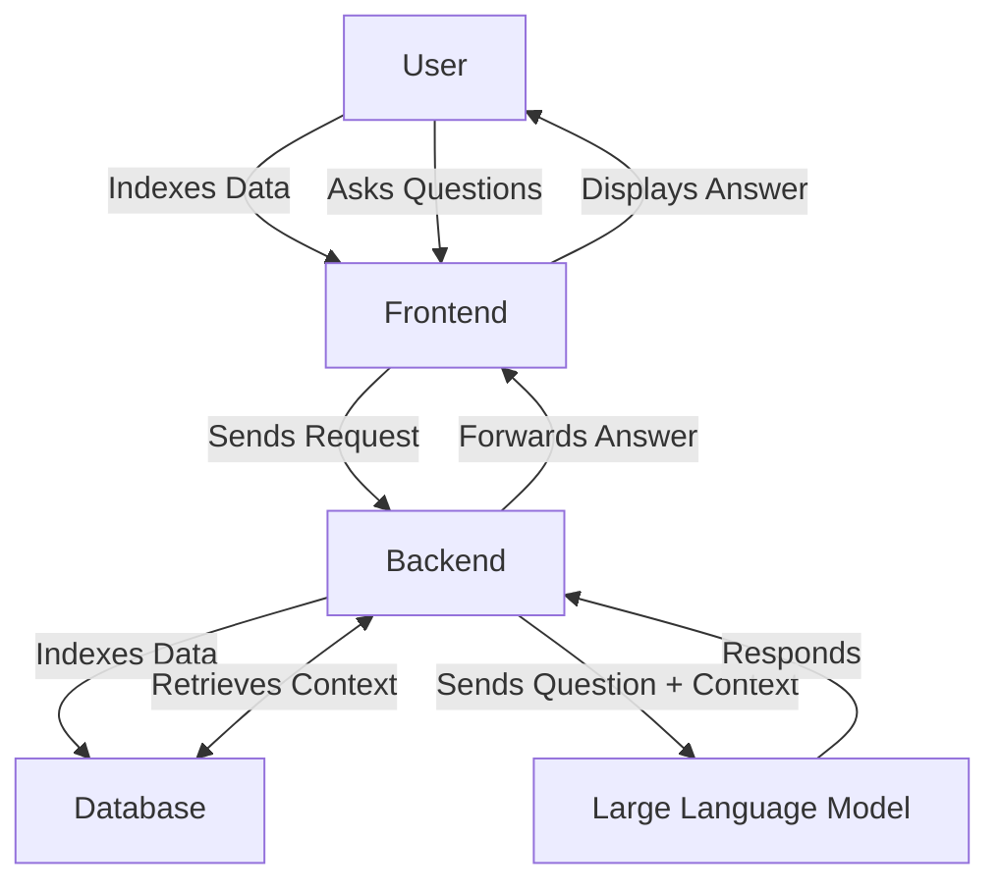

<p align="center"></p>
<p align="center"></p>

## Table of Contents

- [Run HagenCopilot](#run-hagencopilot)
- [Project Context](#project-context)
- [Background & Idea](#background--idea)
- [Implementation Details](#implementation-details)
- [Solution Sketch](#solution-sketch)
- [Evaluation](#evaluation)
  - [Dataset](#dataset)
  - [Metrics](#metrics)
  - [Results](#results)
  - [Run Evaluation Pipeline](#run-evaluation-pipeline)

## Run HagenCopilot

1. Make sure to add a `.env` file. Check the `.env-example` file.
2. Install Python dependencies:

   ```bash
   pip install -r backend/requirements.txt
   ```

3. Start `docker-compose`:

   ```bash
   docker-compose up -d

   # To rebuild the docker images
   docker-compose up -d --build
   ```

4. Place PDF files in the `data` folder and start indexing the files:

   ```bash
   python backend/load_data.py
   ```

   **Note:** The first run requires downloading the embedding model, which may take some time. If the DLL file [libomp140_x86_64](https://www.dllme.com/dll/files/libomp140_x86_64/00637fe34a6043031c9ae4c6cf0a891d/download) is missing, you need to install it.

5. Start the backend:

   ```bash
   python backend/api.py
   ```

6. Now, you can access HagenCopilot at [http://localhost:3000](http://localhost:3000).

## Project Context

This project was part of the **Speech Technology Practical Course** at **FernUniversität Hagen** during the summer semester of 2024. The framework for this project was provided by the **Center of Advanced Technology for Assisted Learning and Predictive Analytics (CATALPA)**.

## Background & Idea

Moodle at FernUni Hagen is a cross-program platform used for courses and information exchange between students. Each module provides learning materials and other resources, along with a forum where students can ask questions. Some questions can only be answered by lecturers, leading to longer waiting times.

A **Q&A chatbot** would be a useful Moodle plugin to assist students quickly. Our prototype can answer academic and administrative questions if the answer is available in the learning materials or examination regulations. This reduces the workload for lecturers and provides students with faster responses. The chatbot not only generates answers but also references the relevant sources, which can be uploaded during the conversation.

Initially, the chatbot was supposed to dynamically index forum posts to prevent duplicate questions. However, due to privacy concerns, this was difficult to implement, as processing forum posts would require consent from all participants.

## Implementation Details

Users can provide **PDF files** in a local folder, which serve as the knowledge base for the chatbot.

1. The PDF files are **split into vectors** (embeddings) based on text size.
2. Once indexed, users can interact with the chatbot via a **chat interface** similar to ChatGPT.
3. The chatbot **retrieves relevant context** from the database based on the user’s question.
4. A **Large Language Model (LLM)** hosted on FernUni Hagen's servers formulates a **coherent response**.
5. The chatbot provides an answer along with **references to sources**.
6. Users can now **dynamically expand** the database by uploading new PDFs via an integrated button.

If a file already exists in the database, a notification prevents duplicate entries, ensuring data integrity.

## Solution Sketch



## Evaluation

The chatbot’s performance was evaluated using the **Ragas package**, comparing the following LLMs:

- **gemma_latest**
- **llama3_70b**
- **llama3_latest**
- **mistral_latest**
- **mixtral_latest**

### Dataset

The dataset consists of **questions and answers** created by students from the "Data, Document, Information, and Knowledge Management" course:

1. **simple.json**: Questions with direct answers found in the course units.
2. **hard.json**: Questions requiring cross-referencing multiple sections.
3. **unknown.json**: Questions not answerable using the provided documents.

### Metrics

The following **Ragas metrics** were used:

- **Context Recall (CR)**: Measures how much relevant information was retrieved.
- **Context Precision (CP)**: Ensures relevant elements rank higher than non-relevant ones.
- **Faithfulness**: Evaluates factual correctness based on context.
- **Answer Relevancy (AR)**: Measures how well the response aligns with the question.
- **Answer Correctness (AC)**: Compares generated responses to reference answers.

### Results

For **simple questions**, all LLMs performed similarly. **Context Recall** ranged between 0.67 and 0.73, and **Context Precision** between 0.69 and 0.73.


Regarding **generation metrics**, **Faithfulness** was between 0.64 and 0.67, and **Answer Relevancy** between 0.75 and 0.84.


For **harder questions** in "schwierig.json", **Context Recall** ranged between 0.73 and 0.83. **mistral_latest** performed best, while **gemma_latest** and **llama3_70b** showed lower recall.


**Faithfulness** varied between 0.49 and 0.77, with **gemma_latest** and **llama3_70b** performing best, while **mixtral_latest** scored lowest. The **Answer Relevancy** ranges between 0.75 and 0.84, with mistral_latest showing the best result.


Overall, the models show more variable results for difficult questions, particularly in **Context Recall** and **Faithfulness**. Looking only at **Faithfulness**, which measures the factual correctness of answers, **gemma_latest**, **llama3_70b**, and **mistral_latest** performed significantly better than the other models. **mistral_latest** also achieved the best results in **Context Recall**, making it the best-performing LLM overall for the difficult dataset. However, to reliably determine that this model is the most suitable, the chatbot would need to be evaluated with a much larger dataset, which would exceed the scope of this internship.  

Using the **unbekannt.json** dataset, it was shown that the model can recognize when a question touches on similar topics (e.g., "Internet security") but does not have relevant context to provide an answer. In such cases, the chatbot informed the user that it could not answer the question.  

> **Note:** The **Answer Correctness** metric did not seem very meaningful, as the length of the answer had a strong influence on the score. Therefore, it was not included in the evaluation.  

---

## Run Evaluation Pipeline  

To successfully run the evaluation pipeline, ensure that the following prerequisites are met:  

1. **VPN Connection:** Make sure an active VPN connection is established if required.  
2. **Docker-Compose:** Verify that Docker and Docker-Compose are installed and running.  
3. **Data Indexing:** Ensure that the data has already been indexed.  

Then, run the evaluation pipeline using the following command:  

```bash
python backend/evaluation.py
```
